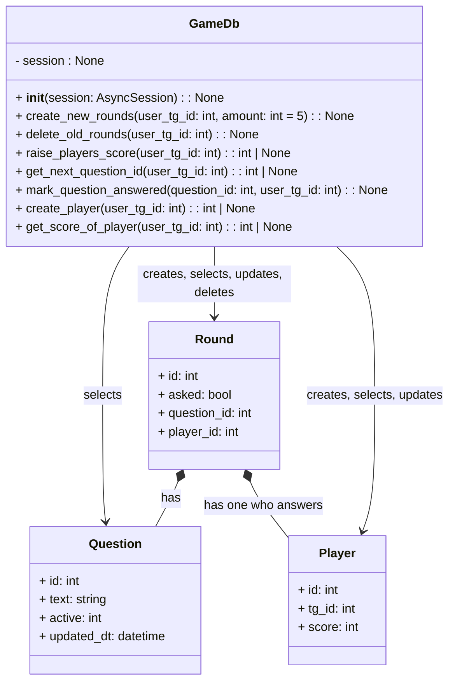

## About
FastApi educational service for answering quizzes.

It's an edit version of my other study project where telegram bot uses these handlers.

- handlers for adding questions and answers (it can be several correct answers for one question, but for telegram it would be only one button)
- admin handlers for getting info of tests (quiz)
- handler for checking answer with correct answers
- handler to see score of a player (with particular telegram chat id)

## Stack
FastApi, sqlalchemy, postgres, alembic, docker, poetry

## Schema

