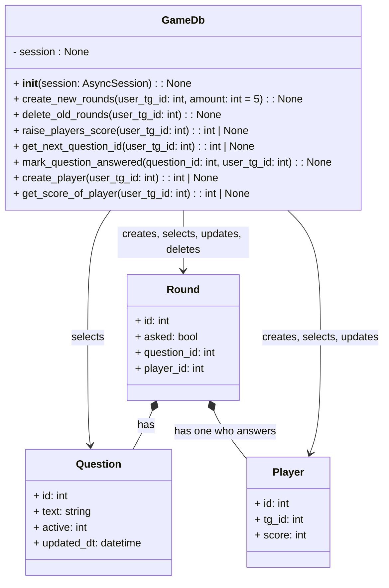

# Quiz Service API 
A FastAPI-based educational service for managing quizzes and tracking player scores. This REST API powers a Telegram bot (in a separate project) that delivers interactive quiz tasks to users.

## 🔗 Related Projects
This API is designed to work with:
https://github.com/alina1412/fastapi_tests_with_telegram_bot
(It's a previous version of a project)

## Api
- handlers for adding questions and answers (it can be several correct answers for one question, but for telegram it would be only one button)
- admin handlers for getting info of tests (quiz)
- handler for checking answer with correct answers
- handler to see score of a player (with particular telegram chat id)
  

## 🛠️ Tech Stack
- Framework:	FastAPI
- Database:	PostgreSQL
- ORM:	SQLAlchemy (async)
- Migrations:	Alembic
- Containerization:	Docker
- Package Manager:	Poetry
- Python Version:	3.11+

## Schema

```mermaid
classDiagram  

class GameDb {
    - session : None
    + __init__(session: AsyncSession) : None
    + create_new_rounds(user_tg_id: int, amount: int = 5) : None
    + delete_old_rounds(user_tg_id: int) : None
    + raise_players_score(user_tg_id: int) : int | None
    + get_next_question_id(user_tg_id: int) : int | None
    + mark_question_answered(question_id: int, user_tg_id: int) : None
    + create_player(user_tg_id: int) : int | None
    + get_score_of_player(user_tg_id: int) : int | None
}

class Question {
  + id: int
  + text: string
  + active: int
  + updated_dt: datetime
}

class Player  {
    + id: int
    + tg_id: int
    + score: int
}

class Round  {
	+ id: int
    + asked: bool
    + question_id: int
    + player_id: int
}


GameDb --> Question : selects

GameDb --> Round : creates, selects, updates, deletes
Round  *-- Question : has
Round  *-- Player : has one who answers
GameDb --> Player : creates, selects, updates
```
